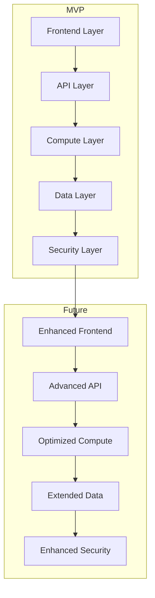

# MVP Alignment Analysis

## Current State Analysis

### 1. Proposal.md
✅ **Well Aligned**
- Clear MVP architecture
- Focused on core Nova chatbot functionality
- Essential AWS services only
- Basic security measures

⚠️ **Needs Adjustment**
- Remove complex future architecture diagram
- Simplify data flow diagram
- Focus on core monitoring only

### 2. Phase_Tasks.md
✅ **Well Aligned**
- Two-week implementation timeline
- Core service setup
- Basic Nova integration
- Essential testing

⚠️ **Needs Adjustment**
- Remove complex VPC setup
- Simplify storage layer
- Focus on basic monitoring
- Streamline testing approach

### 3. Frontend_Tasks.md
✅ **Well Aligned**
- Basic chat interface
- Essential state management
- Core API integration
- Simple error handling

⚠️ **Needs Adjustment**
- Remove advanced features
- Simplify performance optimization
- Focus on core user experience
- Streamline testing

## Required Adjustments

### 1. Proposal.md Updates


### 2. Phase_Tasks.md Updates
```typescript
// Simplified infrastructure setup
class CoreInfrastructure {
  constructor() {
    this.setupAWS();
    this.setupNova();
    this.setupMonitoring();
  }

  private async setupAWS() {
    // Basic AWS setup
    await this.setupCognito();
    await this.setupAppSync();
    await this.setupLambda();
  }

  private async setupNova() {
    // Nova integration
    await this.setupNovaAPI();
    await this.setupKnowledgeBase();
  }
}
```

### 3. Frontend_Tasks.md Updates
```typescript
// Simplified frontend implementation
class FrontendCore {
  constructor() {
    this.setupUI();
    this.setupState();
    this.setupAPI();
  }

  private async setupUI() {
    // Basic UI components
    await this.setupChatInterface();
    await this.setupResultsDisplay();
  }

  private async setupState() {
    // Essential state management
    await this.setupChatState();
    await this.setupUserState();
  }
}
```

## Future-Proofing Elements

### 1. Extension Points
```typescript
// Core service with extension points
class CoreService {
  constructor() {
    this.setupCore();
    this.setupExtensions();
  }

  private setupExtensions() {
    // Extension points for future features
    this.setupFeatureFlags();
    this.setupMonitoringHooks();
    this.setupSecurityExtensions();
  }
}
```

### 2. Feature Flags
```typescript
// Feature management
class FeatureManager {
  private static instance: FeatureManager;
  private features: Map<string, boolean>;

  // Core features for MVP
  private mvpFeatures = {
    basicChat: true,
    simpleQueries: true,
    basicAuth: true
  };

  // Future features
  private futureFeatures = {
    advancedChat: false,
    queryOptimization: false,
    advancedAuth: false
  };
}
```

### 3. Monitoring Hooks
```typescript
// Monitoring with extension points
class MonitoringCore {
  constructor() {
    this.setupBasicMetrics();
    this.setupExtensionPoints();
  }

  private setupExtensionPoints() {
    // Hooks for future monitoring
    this.setupMetricExtensions();
    this.setupAlertExtensions();
    this.setupLoggingExtensions();
  }
}
```

## Implementation Guidelines

### 1. MVP Focus
- Implement core functionality only
- Use extension points for future features
- Maintain clean separation of concerns
- Document extension points clearly

### 2. Future-Proofing
- Design for scalability
- Implement extension points
- Use feature flags
- Maintain modular architecture

### 3. Testing Strategy
- Test core functionality thoroughly
- Document test extension points
- Maintain test coverage
- Include performance benchmarks

### 4. Security Considerations
- Implement basic security measures
- Design for security extensions
- Document security requirements
- Plan for compliance

## Success Criteria

### MVP Success
1. Core Functionality
   - Basic chat works
   - Simple queries execute
   - Data persists correctly
   - Authentication works

2. Performance
   - Response time < 2s
   - Error rate < 5%
   - Basic monitoring

3. Security
   - User authentication
   - Basic data protection
   - API security

### Future Success
1. Enhanced Features
   - Advanced chat
   - Query optimization
   - Advanced security

2. Performance
   - Response time < 500ms
   - Error rate < 0.1%
   - Advanced monitoring

## Next Steps

1. Update Proposal.md
   - Simplify architecture diagrams
   - Focus on core components
   - Add extension points

2. Update Phase_Tasks.md
   - Streamline implementation tasks
   - Add extension point documentation
   - Simplify testing approach

3. Update Frontend_Tasks.md
   - Focus on core UI components
   - Add extension point documentation
   - Simplify testing strategy

4. Create Implementation Guide
   - Document extension points
   - Provide upgrade paths
   - Include testing guidelines 