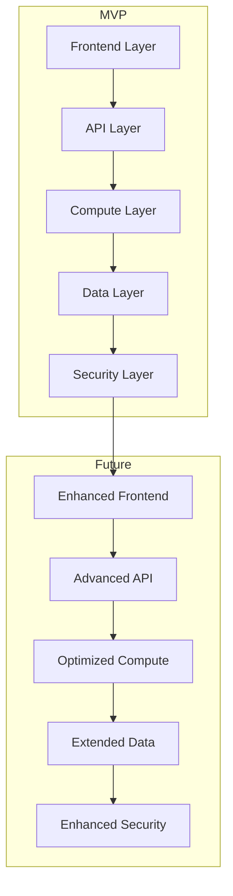

# Combined Implementation Plan - MVP with Future Extensibility

## Overview
This document combines the essential elements from the proposal, phase tasks, frontend tasks, implementation flow, and extension details into a cohesive implementation plan. The focus remains on delivering a working MVP while ensuring future extensibility.

## Core Architecture



## Implementation Phases

### Phase 1: Core MVP Setup (Week 1)

#### 1. Development Environment
```typescript
// Core infrastructure setup
class CoreInfrastructure {
  constructor() {
    this.setupAWS();
    this.setupNova();
    this.setupMonitoring();
  }

  private async setupAWS() {
    // Basic AWS setup
    await this.setupCognito();
    await this.setupAppSync();
    await this.setupLambda();
  }

  private async setupNova() {
    // Nova integration
    await this.setupNovaAPI();
    await this.setupKnowledgeBase();
  }
}
```

#### 2. Core Services
```typescript
// Core service implementation
class CoreServices {
  constructor() {
    this.setupStorage();
    this.setupDatabase();
    this.setupAPI();
  }

  private async setupStorage() {
    // Single S3 bucket for MVP
    await this.createS3Bucket();
    await this.setupBucketPolicies();
  }

  private async setupDatabase() {
    // Single DynamoDB table for MVP
    await this.createDynamoDBTable();
    await this.setupTablePolicies();
  }
}
```

### Phase 2: Core Integration (Week 2)

#### 1. Nova Integration
```typescript
// Nova chat implementation
class NovaChat {
  constructor() {
    this.setupChat();
    this.setupContext();
    this.setupResponse();
  }

  async processMessage(message: string): Promise<ChatResponse> {
    // Basic chat functionality
    const response = await this.nova.processMessage(message);
    return this.formatResponse(response);
  }
}
```

#### 2. Query Processing
```typescript
// Query processing implementation
class QueryProcessor {
  constructor() {
    this.setupAthena();
    this.setupCaching();
  }

  async executeQuery(query: string): Promise<QueryResult> {
    // Basic query execution
    const result = await this.athena.executeQuery(query);
    return this.formatResult(result);
  }
}
```

## Testing Strategy

### Core Testing
```typescript
class CoreTester {
  constructor() {
    this.setupTestEnvironment();
  }

  async runCoreTests() {
    // Essential functionality tests
    await this.testAuthentication();
    await this.testChat();
    await this.testQueries();
    await this.testData();
  }
}
```

### Performance Monitoring
```typescript
class PerformanceMonitor {
  constructor() {
    this.setupMetrics();
  }

  // MVP Metrics
  private benchmarks = {
    responseTime: 2000, // 2 seconds
    errorRate: 0.05,    // 5%
    throughput: 10      // requests/second
  };
}
```

## Feature Management

### Feature Flags
```typescript
class FeatureManager {
  private static instance: FeatureManager;
  private features: Map<string, boolean>;

  // Core features for MVP
  private mvpFeatures = {
    basicChat: true,
    simpleQueries: true,
    basicAuth: true
  };

  // Future features
  private futureFeatures = {
    advancedChat: false,
    queryOptimization: false,
    advancedAuth: false
  };
}
```

## Implementation Flow

### 1. Core Setup
1. Development Environment
   - AWS CDK setup
   - Nova integration
   - Basic monitoring

2. Core Services
   - Storage setup
   - Database setup
   - API setup

### 2. Integration
1. Nova Integration
   - Chat functionality
   - Context management
   - Response formatting

2. Query Processing
   - Basic queries
   - Result formatting
   - Error handling

## Success Criteria

### MVP Success
1. Core Functionality
   - Basic chat works
   - Simple queries execute
   - Data persists correctly
   - Authentication works

2. Performance
   - Response time < 2s
   - Error rate < 5%
   - Basic monitoring

3. Security
   - User authentication
   - Basic data protection
   - API security

### Future Success
1. Enhanced Features
   - Advanced chat
   - Query optimization
   - Advanced security

2. Performance
   - Response time < 500ms
   - Error rate < 0.1%
   - Advanced monitoring

## Monitoring and Maintenance

### MVP Monitoring
- Basic metrics
- Error logging
- Simple alerting

### Future Monitoring
- Advanced metrics
- Detailed logging
- Complex alerting

## Documentation

### MVP Documentation
- Core functionality
- Basic setup
- Essential APIs
- Simple deployment

### Future Documentation
- Advanced features
- Complex setups
- Extended APIs
- Production deployment

## Implementation Guidelines

### 1. MVP Focus
- Implement core functionality only
- Use extension points for future features
- Maintain clean separation of concerns
- Document extension points clearly

### 2. Future-Proofing
- Design for scalability
- Implement extension points
- Use feature flags
- Maintain modular architecture

### 3. Testing Strategy
- Test core functionality thoroughly
- Document test extension points
- Maintain test coverage
- Include performance benchmarks

### 4. Security Considerations
- Implement basic security measures
- Design for security extensions
- Document security requirements
- Plan for compliance 