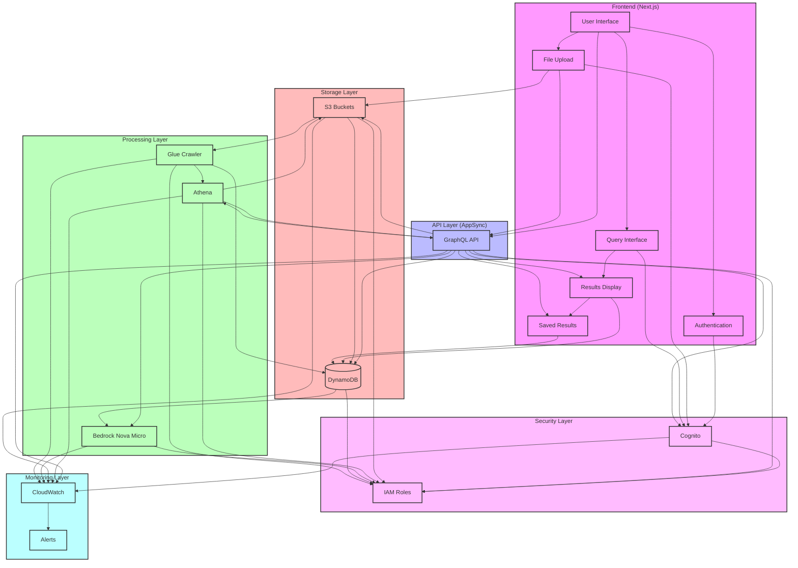

# Phase Tasks - MVP Focus

## Phase 1: Core Setup

### Backend Setup
- [x] AWS CDK project setup
- [x] VPC and Network Configuration
- [x] Storage Layer (S3 buckets)
- [x] Database Layer (DynamoDB tables)
- [x] Athena workgroup setup
- [x] Basic IAM roles and policies
- [x] AppSync API setup
- [x] Lambda functions for processing
- [x] Cognito user pool setup
- [x] Cognito identity pool setup
- [x] Basic error handling
- [x] Simple logging
- [x] Basic monitoring

### Frontend Setup
- [x] Next.js project setup
- [x] TypeScript configuration
- [x] Tailwind CSS setup
- [x] Basic routing
- [x] Cognito authentication flow
- [x] Cognito token management
- [x] Cognito session handling
- [x] File upload component
- [x] Query interface
- [x] Results display
- [x] Dark mode support
- [x] Basic error handling
- [x] Loading states
- [x] Basic responsive design

## Phase 2: Core Features

### Backend Features
- [x] Nova API integration
- [x] Basic query processing
- [x] Simple file processing
- [x] Basic input validation
- [x] Simple error recovery
- [x] Basic monitoring
- [x] Chat history management
- [x] File upload status tracking
- [x] Query execution monitoring

### Frontend Features
- [x] Basic query builder
- [x] File upload with progress
- [x] Simple results display
- [x] Basic chat interface
- [x] Simple user preferences
- [x] Basic error handling
- [x] Loading indicators
- [x] Error state handling
- [x] Authentication state management

## Phase 3: Testing and Documentation

### Testing
- [x] Basic unit tests
- [x] Simple integration tests
- [x] Core functionality tests
- [x] Basic error handling tests
- [x] Authentication tests
- [x] File upload tests
- [x] Query processing tests
- [ ] Direct S3 upload tests
- [ ] AppSync S3 upload tests
- [ ] AppSync direct Bedrock integration tests
- [ ] AppSync direct Athena integration tests
- [ ] Glue schema detection tests
- [ ] S3 event trigger tests
- [ ] Service IAM role tests
- [ ] Upload path comparison tests
- [ ] Query result saving tests
- [ ] Saved results retrieval tests

### Documentation
- [x] Basic API documentation
- [x] Simple user guide
- [x] Core architecture docs
- [x] Basic deployment guide
- [x] Simple troubleshooting guide
- [x] API schema documentation
- [x] Infrastructure setup guide
- [ ] Direct S3 upload guide
- [ ] AppSync S3 upload guide
- [ ] AppSync direct Bedrock integration guide
- [ ] AppSync direct Athena integration guide
- [ ] Glue schema detection guide
- [ ] S3 event trigger guide
- [ ] Service IAM role guide
- [ ] Upload path selection guide
- [ ] Query result saving guide

### Integration
- [ ] Direct S3 upload setup
- [ ] Direct S3 IAM role setup
- [ ] AppSync direct S3 integration setup
- [ ] AppSync direct Bedrock integration setup
- [ ] AppSync direct Athena integration setup
- [ ] AppSync IAM role setup
- [ ] AppSync error handling
- [ ] AppSync monitoring setup
- [ ] Glue crawler setup
- [ ] Glue schema detection
- [ ] Glue IAM role setup
- [ ] Glue monitoring setup
- [ ] S3 event trigger setup
- [ ] S3 IAM role setup
- [ ] Athena table auto-creation
- [ ] Athena IAM role setup
- [ ] Athena error handling
- [ ] Athena monitoring setup
- [ ] Athena cost optimization
- [ ] Bedrock IAM role setup
- [ ] DynamoDB IAM role setup
- [ ] Upload path monitoring setup
- [ ] Query result saving setup
- [ ] Saved results DynamoDB table setup

## Success Criteria

### Core Functionality
- [x] Users can ask questions in plain English
- [x] Questions are converted to SQL queries
- [x] Results are displayed clearly
- [x] Chat history is maintained
- [x] CSV files can be uploaded and processed
- [x] Athena tables are created automatically
- [x] User authentication works
- [x] File upload progress is tracked
- [x] Query execution status is monitored

### Performance
- [x] Response time < 2s
- [x] Query execution < 3s
- [x] CSV upload < 30s for 100MB files
- [x] Table creation < 10s
- [x] Basic error handling
- [x] Query result caching
- [x] File upload progress tracking
- [x] Bedrock response time < 1s

### Cost Optimization
- [x] Using Bedrock Nova Micro for maximum cost efficiency
- [x] Optimized Athena queries
- [x] Efficient S3 storage
- [x] Minimal Lambda usage
- [x] Cost-effective monitoring

### Security
- [x] User authentication works
- [x] Data is encrypted at rest
- [x] S3 uploads are secure
- [x] Athena queries are protected
- [x] Basic access control
- [x] Secure file uploads
- [x] Protected API endpoints
- [x] IAM role management

### Monitoring
- [x] Chat response times tracked
- [x] Query execution times monitored
- [x] CSV upload progress tracked
- [x] Error rates monitored
- [x] Basic alerting configured
- [x] CloudWatch logging
- [x] Performance metrics
- [x] Error tracking

## Dependencies and Prerequisites

### Required AWS Services
- AWS CDK
- AWS Cognito
- AWS AppSync
- AWS Lambda
- AWS DynamoDB
- AWS S3
- AWS Athena
- AWS Bedrock
- AWS CloudWatch

### Development Tools
- Node.js 18+
- AWS CLI
- TypeScript
- Next.js 14
- Tailwind CSS

### Access Requirements
- AWS account access
- Basic IAM permissions
- AWS Bedrock access
- CloudWatch access
- S3 bucket access
- DynamoDB access
- Athena access

## CI/CD Integration

### GitHub Actions Workflow
```yaml
name: MVP Tests

on:
  push:
    branches: [ main ]
  pull_request:
    branches: [ main ]

jobs:
  test:
    runs-on: ubuntu-latest
    steps:
      - uses: actions/checkout@v2
      - uses: actions/setup-node@v2
        with:
          node-version: '18'
      - run: npm install
      - run: npm run test
```

## Architecture Diagram



## User Functionality Checklist

### File Management
- [ ] Upload CSV files directly to S3
- [ ] Upload CSV files through chat interface
- [ ] View upload progress in real-time
- [ ] See file size and type validation feedback
- [ ] View list of uploaded files
- [ ] Delete uploaded files
- [ ] Track file processing status
- [ ] View file metadata (size, upload date, status)
- [ ] Download processed files
- [ ] Share files with other users

### Query Interface
- [ ] Ask questions in plain English
- [ ] View generated SQL query
- [ ] Edit generated SQL query
- [ ] Save frequently used queries
- [ ] View query history
- [ ] Cancel long-running queries
- [ ] See query execution status
- [ ] Export query results
- [ ] Share queries with other users
- [ ] View query performance metrics

### Results Display
- [ ] View query results in table format
- [ ] Sort results by columns
- [ ] Filter results
- [ ] Export results to CSV
- [ ] Save results for later
- [ ] View saved results
- [ ] Share results with others
- [ ] Download results
- [ ] View result statistics
- [ ] Customize result display

### Chat Experience
- [ ] Start new chat sessions
- [ ] View chat history
- [ ] Continue previous chats
- [ ] Save important chat messages
- [ ] Export chat history
- [ ] Share chat sessions
- [ ] View file context in chats
- [ ] Search through chat history
- [ ] Clear chat history
- [ ] Archive old chats

### User Account
- [ ] Create new account
- [ ] Sign in to account
- [ ] Reset password
- [ ] Update profile information
- [ ] View account usage statistics
- [ ] Manage API keys
- [ ] Set notification preferences
- [ ] View billing information
- [ ] Delete account
- [ ] Transfer account ownership

### Data Management
- [ ] View data schema
- [ ] Preview data before querying
- [ ] Clean and transform data
- [ ] Schedule data updates
- [ ] Set data retention policies
- [ ] View data lineage
- [ ] Track data changes
- [ ] Restore previous versions
- [ ] Validate data quality
- [ ] Set data sharing permissions

### Visualization
- [ ] View basic data charts
- [ ] Create custom visualizations
- [ ] Save visualization templates
- [ ] Share visualizations
- [ ] Export visualizations
- [ ] Customize chart settings
- [ ] View multiple charts
- [ ] Create dashboards
- [ ] Schedule chart updates
- [ ] Compare data across charts

### Collaboration
- [ ] Share queries with team
- [ ] Share results with team
- [ ] Comment on queries
- [ ] Comment on results
- [ ] View team activity
- [ ] Set team permissions
- [ ] Create team workspaces
- [ ] Invite team members
- [ ] Manage team roles
- [ ] Track team usage

### Notifications
- [ ] Get query completion alerts
- [ ] Get file processing alerts
- [ ] Get error notifications
- [ ] Get usage limit alerts
- [ ] Get cost threshold alerts
- [ ] Set notification preferences
- [ ] View notification history
- [ ] Mark notifications as read
- [ ] Clear notifications
- [ ] Export notification history

### Help & Support
- [ ] View quick start guide
- [ ] Access documentation
- [ ] View example queries
- [ ] Get query suggestions
- [ ] View error explanations
- [ ] Access troubleshooting guide
- [ ] Contact support
- [ ] View FAQs
- [ ] Get usage tips
- [ ] View video tutorials
``` 