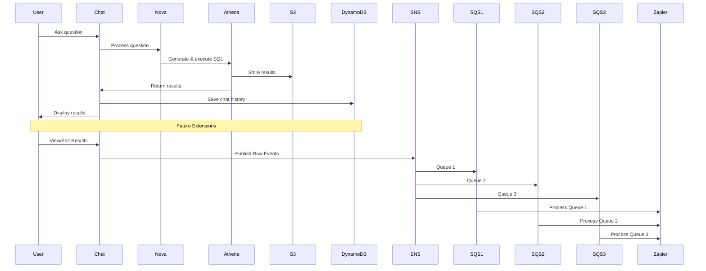

# Natural Language Query System - MVP Focus

## Overview
This proposal outlines a simple implementation of a natural language query system using Nova chatbot and AWS services. Users can ask questions in plain English, and the system will convert these into SQL queries and return results. The system is designed to be extensible, allowing future integration with data manipulation features and event-driven processing.

## Core Functionality

### 1. Natural Language Processing
- Nova chatbot for understanding user questions
- Conversion of questions to SQL queries
- Basic context management
- Simple error handling

### 2. Data Processing
- Athena for query execution
- S3 for result storage
- DynamoDB for chat history
- Basic caching

### 3. User Interface
- Simple chat interface
- Results display
- Basic error messages
- Loading states

## Architecture



## Implementation Phases

### Phase 1: Core Setup (Week 1)
1. **Basic Infrastructure**
   - AWS CDK setup
   - Nova integration
   - Simple storage

2. **Core Services**
   - Chat processing
   - Query execution
   - Basic storage

### Phase 2: Integration (Week 2)
1. **Chat Integration**
   - Question processing
   - SQL generation
   - Result formatting

2. **Data Flow**
   - Query execution
   - Result storage
   - History tracking

## Technical Stack

### Core Services
- Nova API for natural language processing
- AWS Athena for query execution
- AWS S3 for result storage
- AWS DynamoDB for chat history
- AWS Cognito for authentication
- AWS AppSync for API

### Frontend
- Next.js 14
- TypeScript
- Tailwind CSS
- Zustand for state

### Future Services
- AWS SNS for event publishing
- AWS SQS for queue management
- Zapier for external integrations

## Success Criteria

### Core Functionality
- [ ] Users can ask questions in plain English
- [ ] Questions are converted to SQL queries
- [ ] Results are displayed clearly
- [ ] Chat history is maintained

### Performance
- [ ] Response time < 2s
- [ ] Query execution < 3s
- [ ] Basic error handling

### User Experience
- [ ] Simple chat interface
- [ ] Clear result display
- [ ] Basic error messages
- [ ] Loading indicators

## Testing Strategy

### Core Tests
```typescript
// Test natural language processing
async function testQuestionProcessing() {
  const question = "Show me sales for last month";
  const result = await processQuestion(question);
  assert(result.sql.includes("SELECT"));
  assert(result.sql.includes("sales"));
}

// Test query execution
async function testQueryExecution() {
  const sql = "SELECT * FROM sales LIMIT 1";
  const result = await executeQuery(sql);
  assert(result.rows.length > 0);
}

// Future: Test data manipulation
async function testDataManipulation() {
  const result = await executeQuery("SELECT * FROM sales LIMIT 1");
  const modifiedRow = await modifyRow(result.rows[0]);
  await publishToSNS(modifiedRow);
  // Verify SNS/SQS integration
}
```

## Future Enhancements

### 1. Data Manipulation
- Row-level editing
- Data deletion
- Batch operations
- Data validation

### 2. Event Processing
- SNS topic setup
- SQS queue configuration
- Zapier integration
- Event monitoring

### 3. Performance
- Query optimization
- Result caching
- Advanced monitoring
- Performance analytics

This proposal focuses on delivering a simple but effective natural language query system, with a clear path for future enhancements including data manipulation and event-driven processing through SNS/SQS queues. 